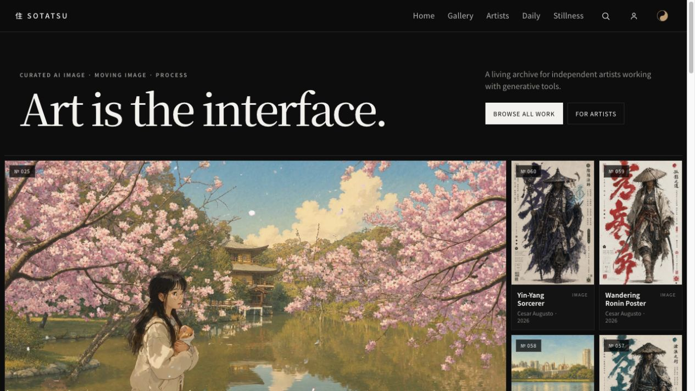

# SOTATSU engineering exhibit

A compact, non-production exhibit built from selected SOTATSU API and worker modules. It makes credential scopes, studio ownership, upload byte limits, retry behavior, and safety-provider failures inspectable with fictional data.

## Run

Use Node 22 and pnpm 11.9.0:

```sh
pnpm install --frozen-lockfile
pnpm dev
pnpm test
pnpm build
```

## Architecture

The React controls call the same scope, studio-filter, length-parser, and safety-verdict functions exercised by Node tests. Upload stream tests run against synthetic byte buffers; no API, database, Redis, object store, or external provider is started.

```text
scoped key → studio-bound query → exact-byte stream → safety verdict → human curation
```

## Evidence and limits

The screenshot below shows SOTATSU’s public gallery as captured on 2026-10-05. It documents the visible site only; it does not verify API or provider deployment. Code paths and file hashes are listed in [SOURCE_PROVENANCE.json](docs/SOURCE_PROVENANCE.json). Fixtures contain no production data. This exhibit does not publish the private application or repository history.




Released under the MIT License.
