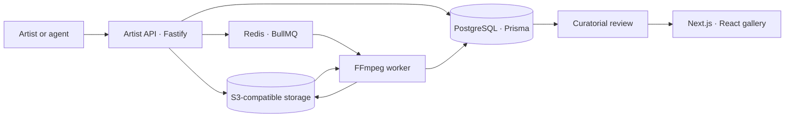

# SOTATSU

SOTATSU is a curated gallery and submission platform for artists using generative image and video tools. Its site uses Next.js 15 and React 19; the backend combines Fastify 5, PostgreSQL with Prisma, Redis and BullMQ, S3-compatible storage, and FFmpeg workers.

This repository presents selected components from the product source, not the full application.

## Product workflow

Approved artists create scoped Artist API keys for their agents or creative toolchains. The API binds projects and assets to the authenticated studio, and upload sessions to their owner. It accepts storage uploads or a server-stream fallback, checking byte limits before processing. Workers validate media, create playback renditions, and move works into curatorial review. Publication remains a curatorial decision.



## Implementation

Keys are HMAC-hashed and expire after 30 days. Project and asset queries include the authenticated studio. Binary upload handling verifies declared and actual length against the session and maximum size. Worker safety verdicts are explicit; production provider outages are retryable. Provider configuration is deployment-specific.

```ts
return required.every((scope) => granted.includes(scope));
```

```ts
if (received > expectedBytes || received > maxBytes) {
  callback(new BinaryLengthError("binary body exceeds declared size"));
  return;
}
```

These excerpts are in [Artist API policy](src/artist-api-policy.ts) and [binary upload handling](src/binary-upload.ts). Source revision and file hashes are recorded in [SOURCE_PROVENANCE.json](docs/SOURCE_PROVENANCE.json).

## Gallery


